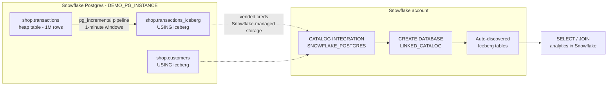

# Postgres → Snowflake in 5 SQL files (with `pg_lake` + `pg_incremental`)

> Move 1M (or 100M, or 1B) rows from a regular Postgres OLTP table to Snowflake-queryable Iceberg tables — **with no S3, no IAM, no external CDC tooling, and no per-table DDL on the Snowflake side.** One pipeline declaration handles both the historical backfill and the ongoing sync, exactly-once.

This repo is the runnable companion to the Medium article. It's intentionally tiny: **five numbered SQL files, top to bottom**, one README, one LICENSE.

## Architecture



## Why this works

- **Zero infra.** Snowflake-managed object storage; no S3 bucket, no IAM role, no external volume.
- **One pipeline = backfill + ongoing.** `pg_incremental` ships an exactly-once primitive that handles historical loading AND new writes in a single declaration. No separate "history loader" + "CDC job."
- **Snowflake side has no per-table DDL.** A catalog-linked database auto-discovers every Iceberg table in your Postgres schema. New tables in PG → instantly queryable in SF.

## Repo layout

```
.
├── README.md
├── LICENSE
├── 1_provision_postgres.sql        ← Snowflake: network rule + policy + Postgres instance
├── 2_seed_postgres.sql             ← psql: customers (10) + transactions heap (1M rows)
├── 3_create_iceberg_pipeline.sql   ← psql: pg_lake + pg_cron + pg_incremental + ONE pipeline
├── 4_query_from_snowflake.sql      ← Snowflake: catalog integration + linked DB + analytics
└── 5_teardown.sql                  ← Snowflake: drops everything (and stops the bill)
```

## Prereqs

- A Snowflake account on **AWS or Azure** (`pg_lake` is preview, not yet on GCP).
- A role with `CREATE INTEGRATION`, `CREATE POSTGRES INSTANCE`, `CREATE DATABASE`, `CREATE NETWORK POLICY`, `CREATE NETWORK RULE`. `ACCOUNTADMIN` works for the demo.
- Local `psql` client (`brew install postgresql@17` or similar).
- The `snow` CLI configured with a connection to your Snowflake account.

## Run order

```bash
# Replace with your Snowflake CLI connection name
SNOW_CONN=my_snowflake_connection
```

### 1. Provision Postgres
First, edit `1_provision_postgres.sql` and replace `REPLACE_WITH_YOUR_IP` with your laptop's public IP:
```bash
curl -s https://api.ipify.org   # paste this value into the file
```
Then:
```bash
snow sql -f 1_provision_postgres.sql -c $SNOW_CONN
```
**Save the password** from the `access_roles` JSON in the output. It cannot be retrieved later.

Wait until `state = READY` (~3-5 min):
```bash
snow sql -q "DESC POSTGRES INSTANCE DEMO_PG_INSTANCE" -c $SNOW_CONN
```

Capture the host:
```bash
HOST=$(snow sql -q "SHOW POSTGRES INSTANCES LIKE 'DEMO_PG_INSTANCE'" -c $SNOW_CONN \
       --format json | python3 -c "import sys,json; print(json.load(sys.stdin)[0]['host'])")
```

### 2. Seed the OLTP table
```bash
PGPASSWORD='<from step 1>' \
  psql "host=$HOST port=5432 dbname=postgres user=snowflake_admin sslmode=require" \
  -f 2_seed_postgres.sql
```
Expect `total_rows = 1000000` in ~10–30 sec.

### 3. The headline: one pipeline does everything
```bash
PGPASSWORD='...' psql "host=$HOST ..." -f 3_create_iceberg_pipeline.sql
```
On creation, `pg_incremental` immediately backfills the full history (`start_time → now()`). After that, a cron job ticks every minute and processes new windows. The trailing query confirms heap and Iceberg row counts match.

### 4. Snowflake side — two statements
```bash
snow sql -f 4_query_from_snowflake.sql -c $SNOW_CONN
```
The catalog integration + catalog-linked database auto-discover both Iceberg tables. Then four analytics queries, including a join across `customers` and `transactions_iceberg`.

### The wow moment
Back in psql, write a few new rows:
```sql
INSERT INTO shop.transactions VALUES
  (9000001, 1, 'Apple',  'Electronics', 1999.00, 'USD', 'USA', now(), 'POSTED'),
  (9000002, 4, 'Costco', 'Groceries',    899.00, 'USD', 'USA', now(), 'POSTED'),
  (9000003, 7, 'IKEA',   'Home',         499.00, 'USD', 'USA', now(), 'POSTED');
```
Wait ~60 seconds for the next pipeline tick (or watch `cron.job_run_details`). Then in Snowflake:
```sql
ALTER ICEBERG TABLE PG_SHOP_LIVE."shop"."transactions_iceberg" REFRESH;
SELECT * FROM PG_SHOP_LIVE."shop"."transactions_iceberg" ORDER BY "txn_ts" DESC LIMIT 5;
```
Three rows inserted in Postgres, surfaced in Snowflake. **No pipeline tooling.**

### 5. Teardown
```bash
snow sql -f 5_teardown.sql -c $SNOW_CONN
```
Stops the Postgres compute, drops the Snowflake objects.

## The freshness knob

`time_interval` in `3_create_iceberg_pipeline.sql` is the dial:

| `time_interval` | When to use |
|---|---|
| `'1 minute'` | Near-real-time freshness. More small Iceberg files. Great demo theater. |
| `'5 minutes'` | Most production analytics SLAs. |
| `'1 hour'` | Cheaper storage and reads. Up to 1 hour of lag. |

Operative rule: **pick the largest interval your analytics SLA tolerates.**

## Mutability addendum (UPDATE / DELETE)

The `time_interval` pipeline shown here is **append-only**. Time-windowed re-reads don't see UPDATEs or DELETEs to old rows. Three patterns when your source is mutable:

1. **Sequence pipeline keyed on `updated_at` + `MERGE`.** Highest fidelity within pg_incremental's primitives.
   ```sql
   SELECT incremental.create_sequence_pipeline(
       pipeline_name      := 'transactions_to_iceberg',
       sequence_name      := 'shop.transactions_updated_at_seq',  -- or use updated_at as a sequence
       command            := $$
           MERGE INTO shop.transactions_iceberg t
           USING (SELECT * FROM shop.transactions WHERE updated_at >= $1 AND updated_at < $2) s
              ON t.txn_id = s.txn_id
            WHEN MATCHED THEN UPDATE SET ...
            WHEN NOT MATCHED THEN INSERT (...) VALUES (...);
       $$
   );
   ```

2. **Rolling-window full reload.** Periodically drop+recreate the most recent N days of the Iceberg table. Simplest logic, more I/O.

3. **Full CDC via logical replication.** Highest fidelity, most moving parts. Reach for this only when 1 and 2 don't fit.

For the 80% append-only case — transactions, events, sensor readings, logs — the time-interval pipeline shipped here is the right answer.

## Gotchas we hit so you don't have to

| Surprise | What to do |
|----------|------------|
| `COMPUTE_FAMILY = 'STANDARD_S'` is rejected. | Use `STANDARD_M` (smallest pg_lake-eligible tier). `BURSTABLE` doesn't support pg_lake at all. |
| Postgres instances ignore `ALLOWED_IP_LIST` on the network policy. | Use `ALLOWED_NETWORK_RULE_LIST` with rules in `MODE = POSTGRES_INGRESS`. |
| Iceberg foreign tables in pg_lake reject `PRIMARY KEY` / `UNIQUE`. | Drop those constraints in the Iceberg-side schema. The heap table can still have them. |
| `incremental.pipelines` doesn't have `source_table_name` or `last_processed_value` columns. | The actual columns are `source_relation` (regclass) on `incremental.pipelines`, and `last_processed_time` on `incremental.time_interval_pipelines`. Join the two. |
| `incremental.executions` doesn't exist. | Use `cron.job_run_details` filtered by command text. |
| First call to `create_time_interval_pipeline` processes the **entire history → now()** in one shot. | Expected behavior. After that, ongoing windows respect `time_interval`. |
| With `time_interval = '1 hour'`, the current hour's window is held open until it elapses. | Correct exactly-once behavior. For demos, use `'1 minute'`. |

## Cost note

`DEMO_PG_INSTANCE` is `STANDARD_M` and is billable while running. Run `5_teardown.sql` when you're done. Storage is 50 GB.

## License

MIT — see [LICENSE](./LICENSE).
